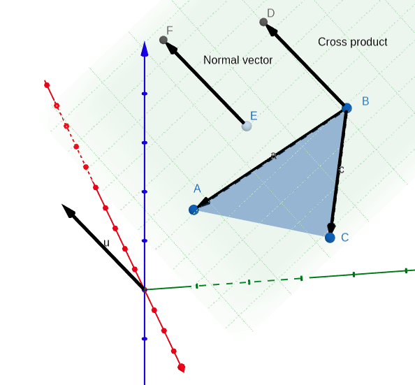
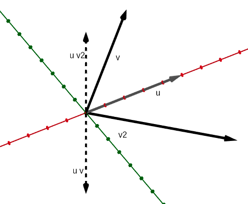
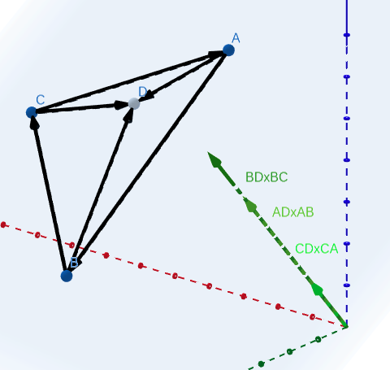
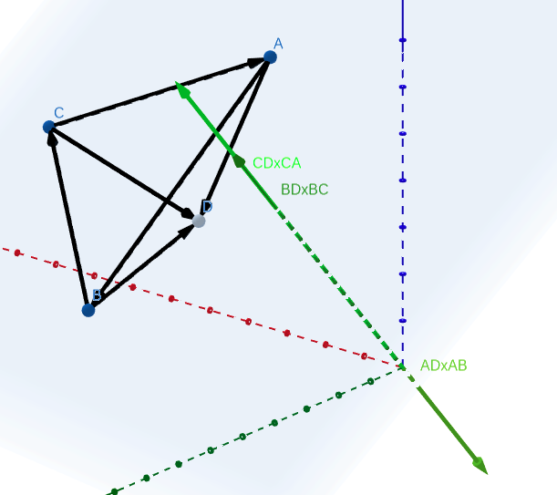
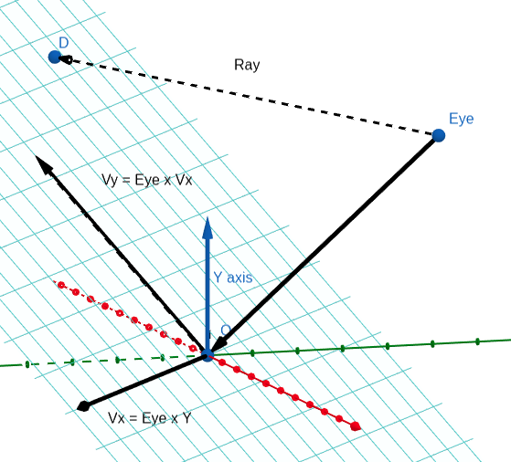
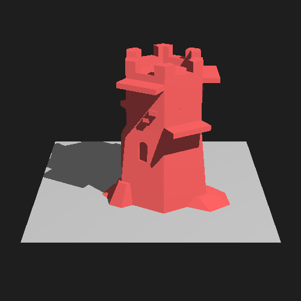
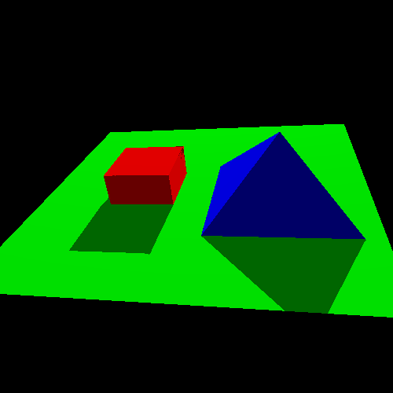
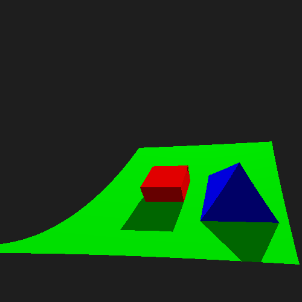
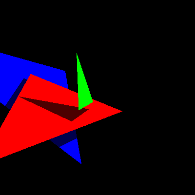

## Simple ray tracer written in Rust from scratch

I've just finished my first semester at the Faculty of ~~Applied~~
Mathematics ~~and Computer Science~~ at the Belarusian SU. I missed conventional
programming a bit and I'm curious to see how I can apply any of my new
knowledge. Finding exciting yet widely applied and simple topic for a side
project turned out to be not that simple. Linear algebra is broadly used in
computer graphics, where I previously came across matrices, transformations and
projections when working with OpenGL, but back then I had only a somewhat
shallow understanding of those topics. I've never done any *ray tracing*, so my
choice simply fell on it. Besides that it somewhat overhyped now and has very
little to almost no theory - just vectors and geometry. I haven't read any posts
or books specifically on ray tracing, so my approach surely won't be the fastest
or most optimal, but I think it will be quite interesting to come up with a
working one.

I've chosen Rust 🦀 because it's my favourite programming language and I haven't
used it for a while. So let's start!

### Everything starts with a ray

I've defined some utils for working with floating point numbers, a Point and
Vector struct and some ~~ugly~~ convenient macros for creating vectors and
points. I first used `f32` for all calculations, but then found out that
precision degrades very quickly, especially for extremely sharp angles. At that
point I had already marked the Point struct as `Copy`, so I kept the marker,
even though its new size of 24 bytes exceeded twice the machine word. This is
just a general rule of thumb and I bet it has almost no effect in this case, as
the average number of arguments in generally low.

Raytracing has obviously something to do with casting rays. A ray is just a line
with a positive direction. A line in space can be defined by a point and a
direction vector. What matters is that we can describe every point on this line
with a single number.

```rust
impl Line {
    pub fn at(&self, t: f64) -> Point {
        self.origin + t * self.direction
    }
}
```

To create an image we have to find out how to intersect rays with objects in
space. Many might associate ray tracing with spheres, because they nicely
demonstrate many visual effects. But I won't cover any of those effects. So
we'll focus just on triangles. Besides that triangles can be used to approximate
almost any shape and 3d models consists of them.
**But how do we find the intersection of a line and a triangle?**

### The plane

First, we have to define the plane which contains the triangle. A plane can be
defined by a single point and a _normal vector_. The normal vector is actually
the cross product of any two vectors in the plane.

<div style="width:400px">




</div>

So lets implement the _cross product_ for vectors:

```rust
impl Vector {
    pub fn cross(&self, v2: Vector) -> Vector {
        Vector {
            x: (self.y * v2.z - self.z * v2.y),
            y: -(self.x * v2.z - self.z * v2.x),
            z: (self.x * v2.y - self.y * v2.x),
        }
    }
}
```

Then we can turn our point-normal pair into a well known equation
`Ax + By + Cz + D = 0`, so our Plane constructor looks like:

```rust
impl Plane {
    pub fn new(p: Point, v1: Vector, v2: Vector) -> MathResult<Self> {
        match v1.cross(v2) {
            v if v.is_zero() => Err(MathError::CollinearVectors),
            Vector { x, y, z } => Ok(Plane {
                a: x,
                b: y,
                c: z,
                d: -(x * p.x + y * p.y + z * p.z),
            })
        }
    }
}
```

To find the intersection of a line and a plane, we can express the coordinates
of all points on the line in terms of our "line parameter", and then substitute
those relations into the planes equation. By solving the equation for the "line
parameter" we get the point of intersection.

### Does the triangle contain it?

There are many ways to determine whether a triangle contains a point in two
dimensions, so I first thought of equivalent approaches: introducing a two
dimensional coordinate system on the plane or looking for intersections with the
triangles sides.

One approach is based on the fact, that if a point lies inside a triangle, then
it lies in the same half plane for each side of the triangle (right or left half
plane, depends on the order of traversal). We can generalize this property for
the third dimension be reviewing one other property for vectors on the plane:
the cross product of a vector with all vectors pointing right of it will point
upwards, and for all vectors left of it - downwards (or downwards/upwards if the
order of vectors in the cross product is flipped).

<div style="width:300px;">



</div>

So if a point lies inside a triangle, then all cross products of each side with
the corresponding vector, connecting the vertex and the point of intersection,
point in the same direction:

<div style="display:flex; justify-content: space-around; ">

<div style="width:400px; ">



</div>


<div style="width:400px;">



</div>

</div>


That results in a simple implementation using the cross product that we already
defined:

```rust
impl Triangle {
    fn is_inside(&self, pt: Point) -> bool {
        self.vertices.iter().enumerate()
            // calculate the cross products for each vertex
            .map(|(pos, vertex)| -> Vector {
                let next_vertex = self.vertices[(pos + 1) % 3];
                vector!(cross   vector!(vertex, pt),
                                vector!(vertex, next_vertex))
            })
            // check if each vector is codirectional with the sum of the previous ones
            // that is equivalent to all of them being pairwise codirectional
            .fold(Some(vector!()), |last_opt, v| -> Option<Vector> {
                match last_opt {
                    Some(last) => if v.is_codirectional(last) { Some(v + last) } else { None }
                    None => None,
                }
            }).is_some()
    }
}
```

A ray intersects a triangle only if it intersects the plane containing the
triangle and the point of intersection lies inside the triangle. Now we know how
to verify both conditions, so lets move on to *casting rays*.

### How to cast rays?

To create an image, we have to cast rays from an "eye" (or camera, or origin)
through an imaginary grid. Finding the best approach to generate such a grid
turned out to be an interesting task. For the sake of simplicity we'll say that
our eye always looks at the origin and its rotation is locked. If it were to be
an airplane, we'd say that its roll is always zero :)


Lets also say, that the global Y axis is the one that points "up". That means,
that if the angle between the eye and the Oxz plane is not 90 degrees (a
top-down projection), then "up" on the image always points "up" in the 3d world.
Now we can see that the plane formed by the "eye" ray and the Y axis will always
be perpendicular to the Oxz plane.

Given those relations, there is a simple way to define the imaginary grid plane
with a 2d coordinate system fixed at the global origin:

* Because our rotation is always zero, our grid will be perpendicular to the
  "eye"-Y axis plane, so we can define our *local X axis* (Vx on the image) as
  the cross product of the Y axis and the "eye" ray.
* Our *local Y axis* (Vy on the image) can be defined as the cross product
  between the "eye" ray and the local X axis.



Because I want the axes to point how I'm used to, ~~we~~ I have to "flip" x and
y when converting image coordinates into rays:

```rust
fn create_ray(env: &Environment, (x, y): (u32, u32)) -> Line {
    let interpolated = |cur: u32, max: u32| -> f64 {
        2f64 * (cur as f64 / max as f64) - 1f64
    };
    let vx = vector!(cross env.origin, vector!(axis y)).normalized();
    let vy = vector!(cross env.origin, vx).normalized();
    let pt = vector!()
        + interpolated(y, IMAGE_SIZE.1) * env.grid_size * vx
        + interpolated(x, IMAGE_SIZE.0) * env.grid_size * vy;
    Line {
        direction: vector!(env.origin, pt),
        origin: env.origin,
    }
}
```

### Turn the lights on!

We already know how to find intersections of lines and triangles. But what about
the _brightness_? In our world all objects will be opaque and there will be only
one source of light - the sun. To find out whether a point on a triangle is lit
by the sun, we have to cast another ray. If the ray from the intersection point
to the sun intersects any other triangle, then our pixel is covered by a shadow.
Because we don't consider on which side the "eye" ray intersected the plane, we
have to make sure that both the sun and the "eye" are in the same half-space,
bounded by the surface plane. Without this check both sides of each triangle
would have the exact same lighting, which is obviously not true for
non-transparent shapes. Two points are in the same half-space if their
corresponding values for the plane formula are of the same sign.

As far as I know, real raytracing casts many more rays to compute reflections,
refractions, scattering etc. Instead, I decided to implement something *similar*
to the _Phong shading_ model, which I'm familiar with from OpenGL. In this
model, the brightness of a "pixel" consists of its _ambient_, _diffuse_ and
specular components:

* Every pixel is at least as bright as the _ambient_ brightness, even if it lies
  in a shadow
* A pixel is brighter if it directly faces the sun, and darker if the angle
  between the surface normal and the sun ray is greater. How much this
  brightness varies in relation to the angle is the defined by the _diffuse_
  part.
* Specular lighting indicates how rough or even a material is
  (the small bright spot on spheres), but it won't be used here

Instead of finding the angle between the surface normal and the "sun" ray, we'll
find just the cosine. The closer the absolute value is to 1, the closer the
normal is to being aligned with the "sun" ray. We can find the cosine using the
dot product.

In our case we will use the ambient color only for covered pixels.

```rust
fn compute_lights(env: &Environment, surface: &Triangle, pt: Point) -> f32 {
    let sun_ray = Line {
        direction: vector!(pt, env.sun),
        origin: pt,
    };
    let covered = env.surfaces.iter()
        .filter(|sf| !sf.triangle.contains(pt))
        .map(|sf| sf.triangle.intersect(&sun_ray))
        // check if any intersection lies on the positive direction of the ray
        .any(|opt| opt.map(|t| t >= -FLOAT_EPS).unwrap_or(false));
    let different_halves = surface.plane.subs(env.origin)
        * surface.plane.subs(env.sun) <= 0.0;
    if covered || different_halves {
        env.ambient_light
    } else {
        let normal = surface.plane.normal();
        let cos = sun_ray.direction.cos(normal).abs() as f32;
        (1.0 - env.diffuse_light) + cos * env.diffuse_light
    }
}
```

### Lets cast finally

It's pretty clear that from all the intersections, we have to discard those,
which are behind our "eye", and choose the closest one from the remaining. Then
we compute the brightness at the point of intersection and multiply it by the
surface color:

```rust
fn cast_ray(env: &Environment, ray: &Line) -> [u8; 3] {
    let intersection_opt = env.surfaces.iter()
        .map(|sf: &ColoredSurface| sf.triangle.intersect(ray).map(|t| (t, sf)))
        .filter(Option::is_some).map(Option::unwrap)
        // check if it lies on the positive direction of the ray
        .filter(|is| is.0 >= -FLOAT_EPS)
        // find closest to the origin
        .min_by(|a, b| a.0.partial_cmp(&b.0).unwrap());
    if let Some((ray_param, surface)) = intersection_opt {
        let brightness = compute_lights(&env, &surface.triangle, ray.at(ray_param));
        surface.color.iter()
            .map(|c| (*c as f32 * brightness) as u8).try_collect().unwrap()
    } else {
        VOID_COLOR
    }
}
```

### Last steps

Now we know how to cast rays, but how do we generate an image? The easiest way
is just to save the ray casting results in an byte array (RBG, 3 bytes per
pixel) and then convert it into a png. We'd also like to import 3d models to
build more complex shapes. Oh, and using Rust and not going multi-threaded would
be kind of lame.

I'm using:

* The [image ](https://crates.io/crates/image) crate to write the color array to
  a png file.
* [obj-rs](https://crates.io/crates/obj-rs) to parse wavefront obj files and
  turn them into triangles.
* [scoped_threadpool](https://crates.io/crates/scoped_threadpool) to avoid
  cluttering the code with `Arc`s when they're unnecessary
* And of course the good old [num_cpus](https://crates.io/crates/num_cpus)

### Results:

The results might seem not that impressive visually, but we're actually
rendering 3d models (with shadows!) in less than just 400 lines of pure Rust
without any graphics or maths libraries.

Low poly wavefront from [Kenney](https://kenney.nl/assets/pirate-kit):



Moving sun:



By using sine in the interpolation function in `create_ray`, we can create some
space curvature :)



My first three triangles (and an odd rotation bug):


